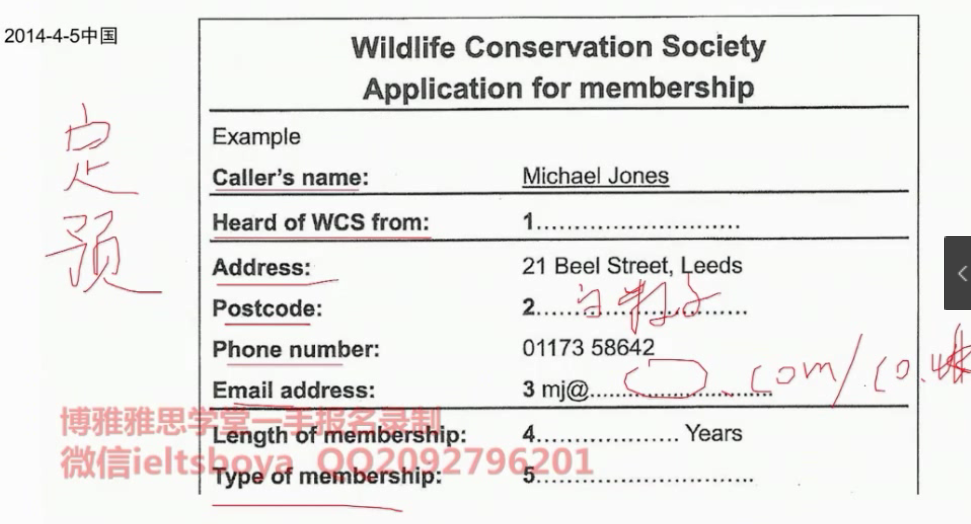
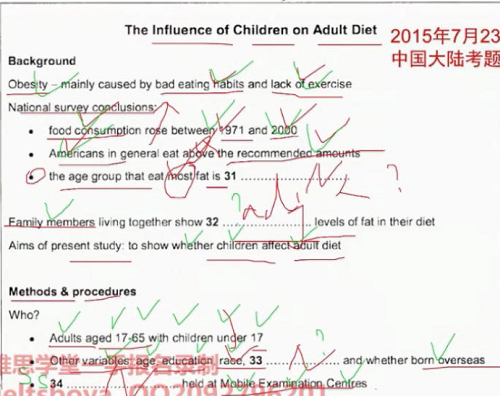
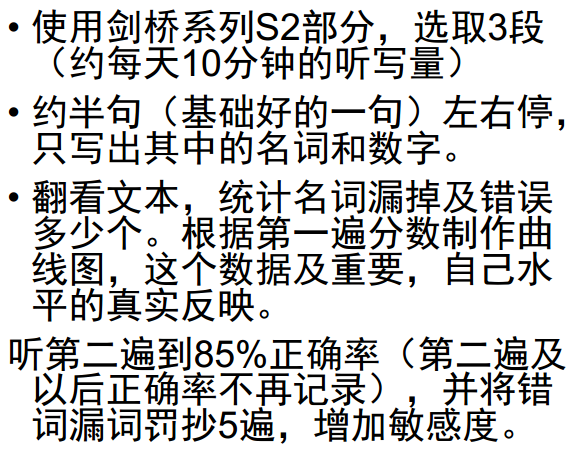

###### 当我们考听力，我考什么？

* 词汇，主要是名词词汇，能听出来，能写出来
* 细节，能抓出单词，而不用过多关注听懂主旨大意

###### 题型

* **填空**

  * Session 1 

    - 定位：找出空位所在的位置，前面对应的就是定位词，注意听。
    - 预判：预判每一个空处的词性和类别。比如。词性是名词，类别可以是 数字，人名，地点。

    

  * Session 4

    * 定位：勾选名词，**以及表示幅度的词**，上升(above, rose, up...) 下降(down, under...)

    * 预判：词性类别

    * 听中：跟随对话，复勾选画的定位词(可能是替换词)，保持节奏，听出后面空的内容

      

* **配对题**

  * Session 2  题干一般是专有名词，一般不会乱序，选项一般是替换词。

    * 定位：看一遍题干，一般都是专有名词，就是提示词。还有前面的topic。
    * 预判：根据选项决定，答案的大概词性和类型。是名词？ 是景点？人？
    * 抓名词：听得时候，定位提示词，专心听前后的名词。
    * 速记：把听到的名词记录下来。
    * 不要在听的时候做答案，在最后的30S再去做。前面的时候专心听和速记。

    

  * 训练方法

    

