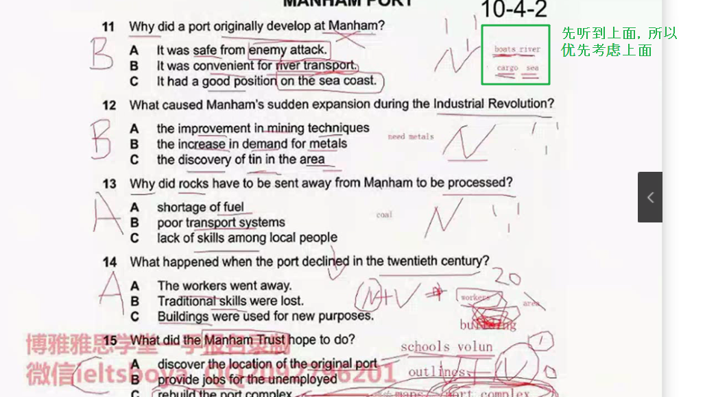
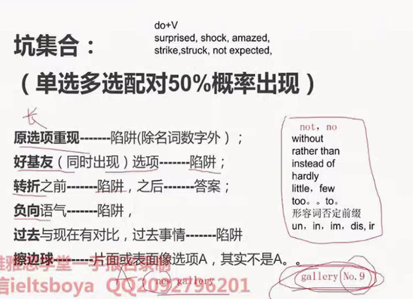
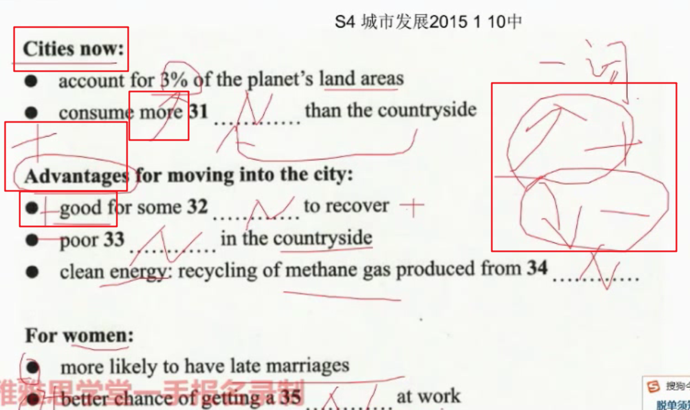

**听力目前都是按照顺序考的，不会调换顺序**

###### 当我们考听力，我考什么？

* 词汇，主要是名词词汇，能听出来，能写出来
* 细节，能抓出单词，而不用过多关注听懂主旨大意

###### 题型

* **填空**

  * Session 1 

    - 定位：找出空位所在的位置，前面对应的就是定位词，注意听。
    - 预判：预判每一个空处的词性和类别。比如。词性是名词，类别可以是 数字，人名，地点。

    

  * Session 4

    * 定位：勾选名词，**以及表示幅度的词**，上升(above, rose, up...) 下降(down, under...)

    * 预判：词性类别

    * 听中：跟随对话，复勾选画的定位词(可能是替换词)，保持节奏，听出后面空的内容

      

* **配对题**

  * Session 2  题干一般是专有名词，一般不会乱序，选项一般是替换词。

    * 定位：看一遍题干，一般都是专有名词，就是提示词。还有前面的topic。
    * 预判：根据选项决定，答案的大概词性和类型。是名词？ 是景点？人？
    * 抓名词：听得时候，定位提示词，专心听前后的名词。
    * 速记：把听到的名词记录下来。
    * 不要在听的时候做答案，在最后的30S再去做。前面的时候专心听和速记。

    

  * 训练方法

    

* 选择题

  * Session 2 单选题

    基本思路就近原则(是定位词旁边出现的第一个选项即为结果)，除非有快捷技巧(but, however)将其否决。但是也防止没有对应选项的情况。

    

    * 快速读题，画词,看选项类型（名词，动词+名词 优先考虑名词）

      * 通篇有的词不画，话句子中重要的部分

    * 抓定位词，然后 主要遵循就近原则。

      * 定位词 A, B, C ===> A
      * 定位词 A, but, B, C ===> B
      * 定位词 A, not/negative , B, C ===> B
      * 定位词 A, 强调 B, C ===> B
      * 定位词 A or B, C ===> C   (A or B 的时候，必须同时出现在选项里面 才可以选)
      * 专有名词一般会前置

    * 坑集合

      

Session 3  趋势

* 如果不确定，听到好几个，就先写上，不纠结，后面听到再确定
* 不要跟着定位词，有可能没有
* 对名词敏感，有利于帮助定位

**地图题** 考的是方向感，识图能力，快速在图里面找词的能力。

* 什么最重要 方向，方位词

* 题型：填空 和 配对类(**为主**)  

* 注意点

  * 注意隐藏信息：比如窗户一般是在门口两边

  * 方位词

    * 东南西北

      ​			NW   N     NE

      ​			W				E

      ​			SW	S	 SE

    *  如果图中出现指南针：立马标记 东南西北

    * 上下左右：top, bottom/under(外围的下方), left, right,

      ​				top

      left						right

      ​				bottom

    * 附近 ： next to, nearby, closed to, one side, beside, next door
    
    * 角落：corner
    
    * 十字路口：intersection, cross, junction
    
    * 对面： opposite, facing
    
    * 拐弯：turn right, turn left, bend
    
    * 中间：circle, center, surrounded, heart, middle
    
    * 第一，最后一个，之前，之后：first, last, end, before, after.

