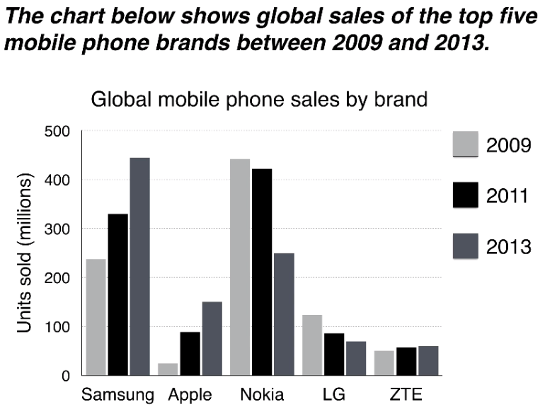

procedure

* make a very general comparison (summary / verview)
  * for A the highest 
  * for B the **figures** are similar for all four **items**
* compare specific numbers (details)
  * compare number of one item
  * compare highest for each item

例子

* 替换标题
  * chart - bar chart
  * shows - compares
  * global sales -  the number of phones sold worldwide 
  * of top 5 mobile phone brands - by 5 most popular manufactures
  * between - in the years 2009, 2011and 2013.
* overview
  * sell the most
  * between and 
  * best selling brands
  * saw the biggest rise in sales 
  * over the 5-year period
* detail
  * In 2009
  * N sold close to / nearly 
  * which was almost double the number
  * of handsets sold
  * by the 2st most successful manufacturer, S
  * Over the following 4 years
  * N's **sales figures** fell by appx 200 million units
  * S saw sales **rise by a similar amount**.
  * In 2013
  * market leader 
  * with sales reaching 450 million units
* detail
  * The other 3 **top selling**  
  * these companies sold 1, 2 , 3 million mobile handsets **respectively**.
  * overtook the other two vendors
  * purchases of Apple handsets 
  * while L saw declining sales
  * figures rose only slightly.

