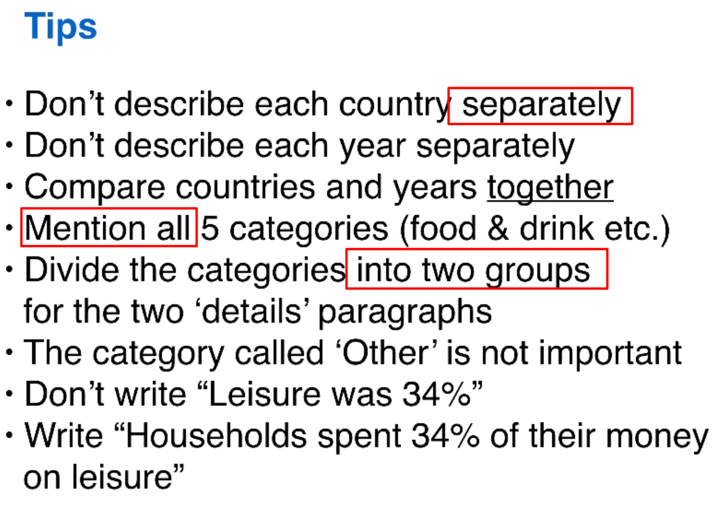

can show numbers, but always show percentage.

* (Around) 50% of the children in the class prefer football to any other sport.
* half of the class said that football was their favorite sport.

The full pie is always 100%

can show changes overtime / between 2 countries

compare the percentages.

don't separate the countries or years.

**procedure**

* make a very general comparison (summary / overview)
  * two similarities
  * one big difference
* compare specific numbers (details)
  * details for overview
  * compare highest for each item

