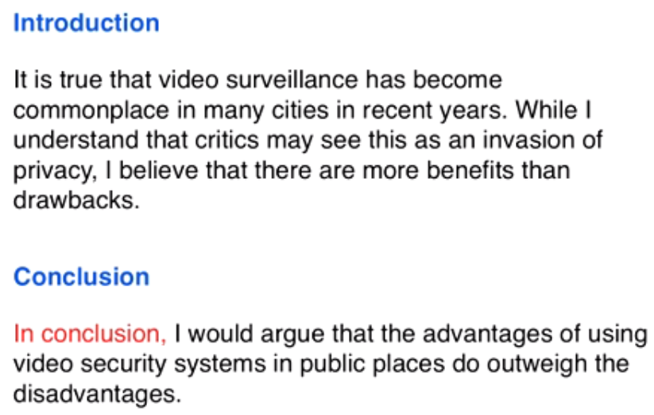

**problem&solution** 

> topic : criminal reoffend
>
> answer : several reasons, a variety of measures
>
> It is true that punishments do not always **deter** criminals from committing more crimes. There are various reasons why **offenders repeatedly** break the law, but governments could certainly **take steps** to **address** this problem.

**two part question**

> topic : job satisfaction
>
> answer : several factors, unrealistic / impossible
>
> Work **plays a central role** in our lives, and we would all like to **feel fulfilled professionally**. While a variety of factors may lead to job **satisfaction**, it would be **unrealistic** to expect everyone to be happy at work.

#### conclusion

never write anything new.

one sentence : repeat & summarise

paraphrase the answer that you gave in your conclusion

**discussion**

> 

**opinion**

**problem solving**

**2-part question**

