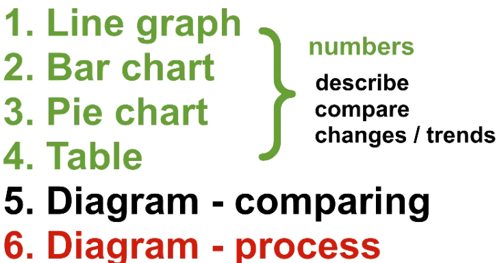
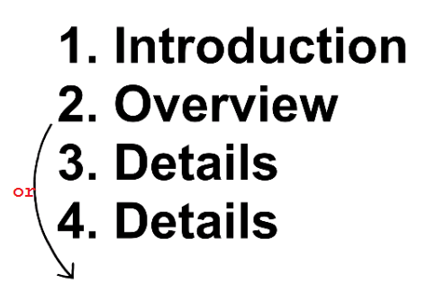
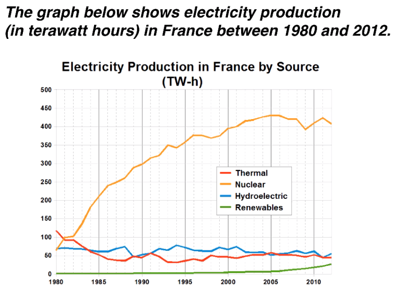
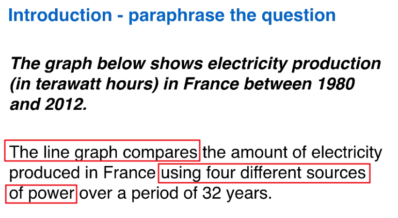
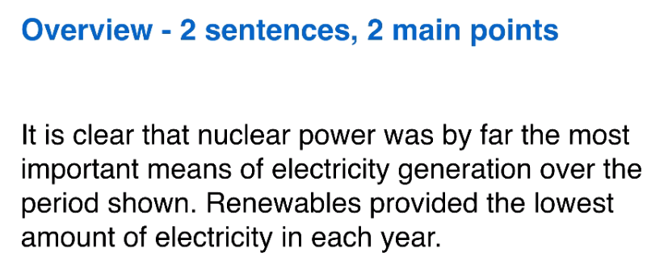
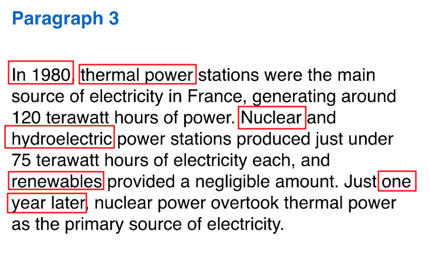
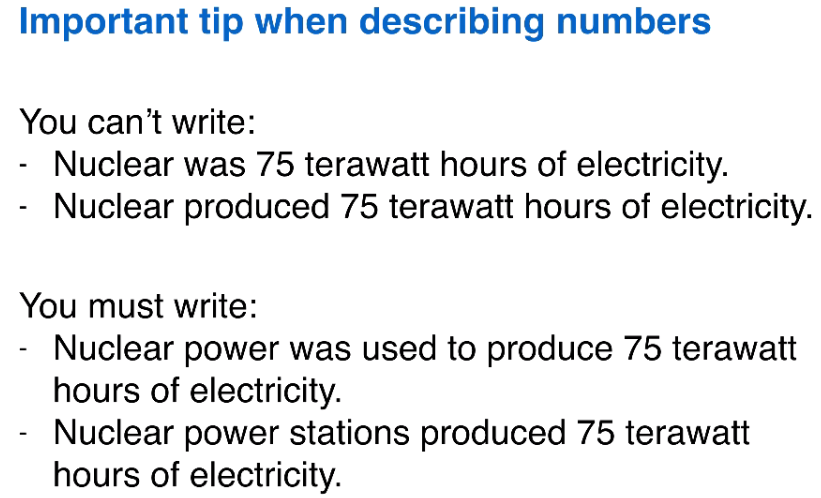
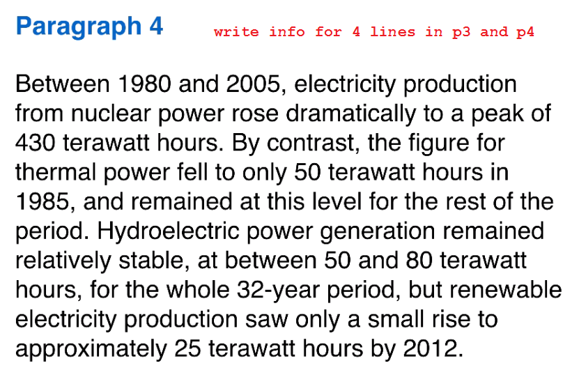
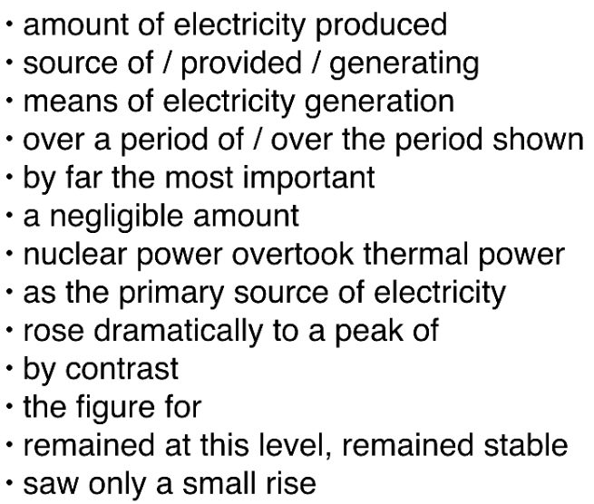

#### 几个基本观点

少用模板

不能用几个老掉牙的观点写所有文章

不能写完中心句就开始重复凑字数

不能直接翻译中文而不注意表达

不能随便写从句而不注意准备

####  Task 1 

description task, write a report, no opinion, no conclusion. Write a summary instead of a conclusion.

**six question types**

**essay structure**

* introduction 
  * one sentence, paraphrase the question
  * take the question and changes order, keywords
* Overview
  * **two sentence : each -> explain main, general things**
* Details 
  * numbers, comparisons, trends
    * comparison : almost double, second most successful 
    * changes : Over the yrs, fell, rise 
  * 2 paragraphs --> make you organize or group info better 
    * high - low
    * first half - second half of a period
* No conclusion. (important)

**Line graph**

* 3-4 lines on the graph

* compare the lines, not to describe them separately

* firstly, make a general comparison in overview

  * the blue is the highest overall.

* secondly, compare lines at specific points

  * write at least one thing about each line

* example

  

  

  

**理解**

* 介绍，标题替换 

  * 展示了: shows, compares, illustrates, dispalys
  * 替换标题的时候，结合图中的内容  using four sources of power
  * 电力，电能  electricity / power
  * 生产的：produced, generated

* 总结，提出一些相对宏观的数据，比如 极大值极小值

  * 最重要的途径：the most important means
  * 到目前为止：by far 
  * 提供了最小值：provide the lowest amount of electricity

* 细节，点的层面，一开始，四个线有交叉的地方

  * 哪一年，A是最主要的来源，生产了大约多少值

    * the major/main/primary source of electricity   
    * , generating around 180 hours of electricity / power

  * B和C各自提供了, D可以忽略的数字

    * produce just under 120 **each**
    * D provide a negligible

    * 一年之后，代替：  Just one yr later, C over too 

  * 哪一年，超了

    * Just one yr later, C **overtook** A as the primary source of electricity.

* 细节，偏向线的层面

  * 1985-2005 之间，A急剧上升到了一个顶点值
    * rose dramatically 
    * to a peak of 430 hours
  * 相反，B的值降到某个点，并一直保持在那个水平
    * by contrast
    * the figure/amount/number of B
    * fell to only 50 
    * and remained at **this** level 
    * for the rest of the period
  * D在整个区间都比较稳定，位置在某一个区间
    * D remained relatively stable
    * , at between 10 and 20, 
    * for the whole **32-year** period
  * C展示了一个很小的增长，截止2012年
    * C saw 
    * only a small rise 
    * to **approximately** 25 hrs 
    * by 2012

