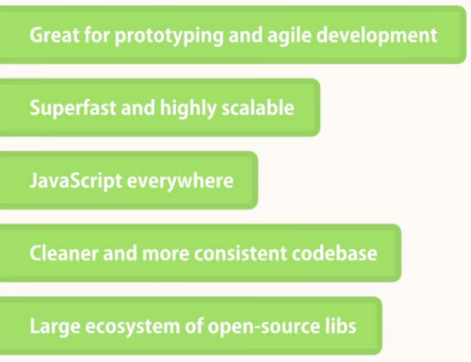

**HTML, CSS & JavaScript**  [a live demo](<https://html-css-js.com/>)

------

**Javascript**  == **ES** (ESMAScript), ES5, ES6...

>  When it came to standardizing the language, Javascript is already a trademark of Sun, so renamed it to ESMAScript which is also hosted by Ecma International.

------

**TypeScript** is the super set of **JavaScript**

**DOM** stands for Document Object Model.

> The HTML is parsed, JavaScript is executed, and the result is the DOM.

**HTML DOM**  is a standard **object** model and **programming interface** for HTM including CUAD methods of element.

------

**Ajax** stands for asynchronous JavaScript and XML, is a **technology** to update a web page without the need to reload the whole page. 

* Use HTML, CSS to make up and style info.
* Use DOM accessed with JavaScript to dynamically display and interact with the info presented.
* Use a method to exchange data asynchronously together with `XMLHttpRequest`.
* Use data format like XML, pre-formatted HTML and JSON (JavaScript Object Notation).

<https://www.janbasktraining.com/blog/javascript-vs-jquery/>

------

**Nodejs** is a runtime env executing JavaScript code.

* 

