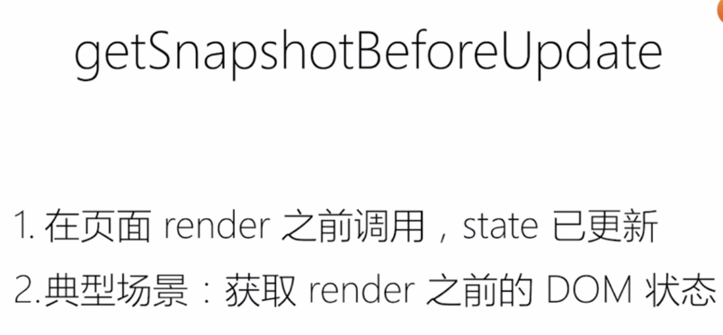

**出现背景**

* 简单的功能一直有bug

  * 传统UI操作关注太多细节

  * 应用程序状态分散在各处，难以追踪和维护

    

    

  * 传统的MVC难以扩展和维护,MV之间双向绑定，出问题难追踪。

    

------

**React好处**

* 一个新概念
* 四个必须的API
* 单向数据流
* 完善的错误提示

------

**核心思想** 单向数据流,衍生的项目：Redux(状态管理的标准), Mobx


------

**以组件的方式考虑UI构建,组织成树形结构**


------

**组件**

* 可以理解为一个纯函数，一般不提供方法，而是某种状态机

* 单向数据绑定

* props(外部传入) + state(内部维护) -> view(决定view长啥样)

* 外面需要知道view内部是状态，需要通过事件知晓

* 分类

  * 受控组件(Form) : 组件本身没有状态，状态由使用者维护

    * ```react
           <input value={this.state.inputMsg} onChange={this.handleInput} />
      ```

    * 上面的例子，如果onChange 去掉，input组件输入就无效，取决于外部的属性，用户输入值不会导致里面的效果改变

  * 非受控组件：表单元素状态DOM自身维护

* 创建组件基本原则

  * 单一职责
  * DRY原则(数据状态管理)
    * 能计算得到的状态不要单独存储
    * 组件尽量无状态，必要数据通过props获取 (纯组件，可重用)

* 约定

  * 自定义组件全部用大写字母开头
  * JSX标记可以使用属性语法：menu.Item

------

**JSX** 

* 不是模板语言，是语法糖

* 在JS代码中直接写HTML的标记

  

  

* 如何使用表达式

  

* 优点

  * 声明式创建页面的直观
  * 代码动态创建页面的灵活
  * 无需学习新的模板语言

------

**生命周期**


* constructor
  * 初始化内部状态，很少使用，唯一可以直接修改state的地方
* 





------

**Virtual DOM**

* JSX的运行基础，只会刷新diff的部分

* 基于两个假设

  * DOM结构相对稳定，很少发生跨层移动
  * 类型相同的兄弟节点可以被唯一标识，指定唯一的K

* 如何工作 (算法复杂度O(n))

  * 

  * 广度优先的分层比较,核心思路是就是一层一层的比较，不同的就删除创建，不管前后依赖关系

    

------

组件复用的另外两种形式

* 高阶组件

  * 对已有组件封装，形成新的组件，提供额外的功能或数据。

    

* 函数作为子组件

  * 新的设计模式
  * 让外部告诉你，你如何显示你选中的状态

  

------

**Context API**   React 16.3+

* 解决多个组件之间通信全局状态的问题

  


------

**脚手架**

* 可以理解成类似 spring boot , 把重复的工作帮你自动做好

* 有哪些

  * create react app from facebook

  * rekit 整合了更多的最佳实践

    

  * codesandbox.io 在线开发平台

------

**打包和部署**

- 为什么需要打包
  - 因为需要编译 ES6语法特性和JSX
  - 需要整合资源，外部样式文件等等
  - 优化代码体积

- 怎么打包：webpack

  - 把项目中所有的资源整合，每种资源以插件的方式载入对应的loader

    

- 注意事项

  - nodejs 设置为 production
  - 禁用开发专用代码，比如 logger
  - 设置应用跟路径

------

**组件库**

* 选择因素

  - 是否齐全
  - 样式风格是否符合业务需求
  - API设计是否便捷灵活
  - 技术支持是否完善
  - 开发是否活跃

* 流行组件库

  * Ant Design : 面向企业,适用于比较复杂的交互场景和密集数据展示场景 各方面其实更加齐全
  * Material-UI : 设计风格更时尚和花哨一点
  * Semantic UI : 历史悠久，没用过的话建议用上面两个

  