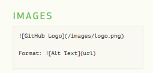
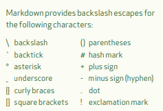

# This is an <h1> tag

## This is an <h2> tag

### This is an <h3> tag

*italic*  _also italic_

**bold**  __also bold__

___italic and bold___


* list 1
  * list 2


blockquotes

> bla bla bla~


1. ordered 1 
2. ordered 2
   * sub ordered 1





[How to show links ](darrenqiao.cn)


backslash with \

\*darren qiao\*



__emoji__

:blue_car: :+1::persevere::hear_no_evil:


`keyword `


__code block__

```java
void main()
{
	return;
}
```


__task list__

- [x] you can check  (\- \[x\])

- [ ] you can uncheck  (\- \[ \])


__table__

`| h1 | h2 |`, and then enter


| h1    | h2    |
| ----- | ----- |
| data1 | data2 |

 

- [ ] todo 

__math__
$$
\sum\limits_{x=1}^{\infty} {1 \over x} = 2
$$


[more about math](https://nbviewer.jupyter.org/github/twistedhardware/mltutorial/blob/master/notebooks/jupyter/2. Markdown %26 LaTeX.ipynb)
